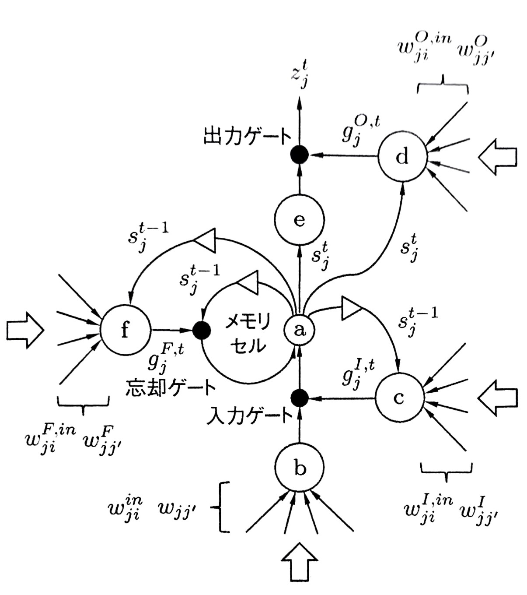

# 深層学習
## 系列データのためのネットワーク
#### 会津大学 コンピュータ理工学研究科 コンピュータ情報システム学専攻 髙橋輝
---

# 系列データ
個々の要素が順序付きの集まり
$$
    \textbf{x}^1, \textbf{x}^2, \textbf{x}^3, \cdots, \textbf{x}^T
$$
として与えられるデータを系列データと呼ぶ

#### 約束
<!-- 
BaseColor: #FF0088
AccentColor: #22FF00
-->
- 要素の並びをインデックス$1, 2, 3,\cdots, T$で表し, $t$を時刻と呼ぶ.
    - 時刻は物理的な時間と対応するとは限らない
- 個々のデータが順序を持っている, つまり, 並びに意味を持っていればよい.
---

# 今回扱う問題
 ### 1. テキスト to 多クラス (Text to Multi-class)
- レストランの利用客の感想を3段階で評価.
- 文を構成する各単語をベクトルで表現. (下に例示)
    $\textbf{x}^1 = `\texttt{They}`, \textbf{x}^2=`\texttt{have}`, \cdots, \textbf{x}^{15} = `\texttt{better}`$
- データの最小単位は一つの文$(\textbf{X}_n =(\textbf{x}^1, \textbf{x}^2, \cdots, \textbf{x}^{T_n})).$
- 単語数は自由なので, 系列長$T_n$も自由.

---
## 今回扱う問題
### 2. 音声認識(Speech Recognition)
- 発話を記録した時間信号から発話内容を推定する.
- 信号は一定の周期で標本化され, 
        量子化されたデジタルデータ(=一般的な音声データ)
- 前処理
    - 方法の例: $10ms$間隔で$25ms$幅の窓で切り出し, 周波数スペクトルの分布情報を取り出して, 特徴ベクトルの系列$(\bf x \rm^1, \bf x \rm^2, \cdots,)$を得る.
- 入力に前処理を行ったデータを取り, 発話を構成する音素(phoneme) or 
発話内容を直接表す文字列を推定する.
### 1, 2共に, 出力は入力と異なる長さの系列を出力できる必要がある
---

# リカレントニューラルネットワーク　<!-- fit -->

---

# 1. リカレントニューラルネットワーク(RNN)とはなんぞや？
A. リカレントニューラルネットワーク(Recurrent Neural Network)とは, 
内部に(有向)閉路を持つニューラルネットワーク の総称である.

- 例として,
    - Elman Network
    - Jordan Network
    - Time Delay Network 
    - Echo State Network など様々なものがあるが, 始めは単純なものを考える.

---

<h2 style="position: absolute; top:80px; left:100px;">シンプルなRNN</h2>

.svg)
.svg)

---

前図のように,中間層のユニットの出力が自分自身に重み付きで戻されるRNNを考える.
この自分自身に戻ってくるパスを帰還路と呼ぶ.

この構造により, 中間層のユニットは, ひとつ前の状態を**覚える**ことができる.

また, このユニットは, ひとつ前の出力と, 現在の入力の両方を考慮して状態が変わるため, 振る舞いを**動的に変化させる**ことができる. 

この二つの特性により, この単純なRNNは系列データ中の"文脈"を捉えることが期待される.

---

RNNは各時刻tにつき1つの入力$\textbf{x}^t$を受け取り, 出力$\textbf{y}^t$を出力する.
これは, 入力と同じ長さの系列を出力することを意味する.

過去に受け取った入力(理論上はすべて)が帰還路を通して出力に影響を与える. 

#### 順伝播型ネットワークとの比較

| | 順伝播型ネットワーク | RNN |
| --- |-------------------- | --- |
| 帰還路 | なし | あり |
| 写像 | $\textbf{x}^{t} \mapsto y$ | $\bf (x^0, x^1, \cdots, x^{t}) \mapsto y$ |

このRNNは, 系列データについて, 順伝播型ネットワークと同じ万能性を持つ.
<!-- 十分な個数の隠れ層ユニットがあれば任意の系列から系列への写像を任意の精度で近似できる. -->
---

# RNNの順伝播

系列$(\bf x^0, x^1, \cdots, x^{t})$を順に入力すると, 系列$(\bf y^0, y^1, \cdots, y^{t})$を出力する.
$$
    y : (\textbf{x}^0, \textbf{x}^1, \cdots, \textbf{x}^{t}) \mapsto (\textbf {y}^0, \textbf{y}^1, \cdots, \textbf{y}^{t})
$$

この計算の詳細を後のスライドで説明するが, その前に定義を行う.
#### 定義
- $\textbf{x}^t = (x_i^t)$ : ネットワークの入力
- $\textbf{u}^t = (u_j^t)$, $\textbf{z}^t = (z_j^t)$ : 中間層ユニットの入出力
- $\textbf{v}^t = (v_k^t)$, $\textbf{y}^t = (y_k^t)$ : 出力層ユニットの入出力
- $\textbf{d}^t = (d_k^t)$: 目標とする出力

---

#### 続・定義

- $\textbf{W}^{(in)} = (w_{ji}^{(in)})$: 入力層と中間層のユニット間の重み
- $\textbf{W} = (w_{j'j})$: 帰還路の結合重み
- $\textbf{W}^{(out)} = (w_{kj}^{(out)})$: 中間層と出力層のユニット間の重み
- $x_0^t = 1, z_0^t = 1$: 各層の$0$番目はバイアスを表現するため, 常に$1$を出力するユニットを配置する.
    - つまり, 中間層のバイアスは, $w_{j0}^{(in)}$, $w_{k0}^{(out)}$によって表現される.

---

時刻$t-1$のユニットから時刻$t$のユニットへの全結合が存在する.
そのため, 中間層への入力は, 
$$
    \textbf{u}^t = \textbf{W}^{(in)}\textbf{x}^t + \textbf{W}z_{t-1}
$$
となり, 中間層の出力は, 活性化関数$f$を経由して, 
$$
    \textbf{z}^t = f(\textbf{u}^t)\
$$
と表示される.

---

この中間層の出力を利用して, RNNの出力$\textbf{y}^t$を計算する.
出力層には, 中間層の重みとは独立に出力層にも重み$\textbf{W}^{(out)}$が存在するため, 出力層ユニットへの入力$\textbf{v}^t$は, 
$$
    \textbf{v}^t = \textbf{W}^{(out)} \textbf{z}^t
$$
と計算され, 活性化関数$\textbf{f}^{(out)}$を経由して, 出力$\textbf{y}^t$が以下のように計算される.
$$
    \textbf{y}^t = \textbf{f}^{(out)}(\textbf{v}^t) = \textbf{f}^{(out)}(\textbf{W}^{(out)} \textbf{z}^t)
$$

なお, 層出力の正規化には, バッチ正規化ではなく, インスタンス正規化を利用する.

---

### 問題への適用
RNNの出力層の設計は, 通常のNNと同じ.
以下は, 例としてクラス分類の場合を考える.
出力層は, クラス数(C)と同様の数のユニットを並べ, ソフトマックス関数を活性化関数に選ぶ.
- 出力系列: $\textbf{y}^1, \cdots, \textbf{y}^t$
- 目標値: $\textbf{d}^1,\cdots ,\textbf{d}^t$
- 訓練サンプルを$n = 1, \cdots, N$として, サンプルnの系列長を$T_n$と書く.
すると, 損失関数は
$$
    E(\textbf{w}) = - \sum_{n=1}^N \sum_{t=1}^T \sum_{k=1}^C \textbf{d}^t_{nk} \log(\textbf{y}^t_k; \textbf{w})
$$
となる.

---

### 同系列長同士の問題
RNNに系列データを入力すると同じ長さの系列が出力データとして得られるため, この構造を持っている問題であれば, そのままRNNを適用することができる.
- N個の単語からなる文を入力に受け取り, 各単語の品詞を決定する問題.
- 連続稼働する機械設備を常時監視し, 異常検知したり, 事前に発生を予測したりする問題.

### 出力が単一要素である問題
出力が単一要素である問題であれば, 同様にRNNを適用できる.
- 感情分析問題
この場合, 例えば, RNNの最後の時刻の出力のみを利用する.

---

### RNNでのリアルタイム推論
要素が逐次, 追加入力されて系列をなすような問題の場合, RNNで実時間推論を行うことができる.
- 例えば, 工業機械の異常検知等

一方, そのような実時間処理が必要とされない場合, 系列データを逆方向に入力することも可能である.
このように逆向きの系列を入力に取るRNNと, 通常の向きのRNNを考え, 両者のRNNの出力層を統合したものが双方向RNN(Bidirectional RNN)である.

- 言語処理モデル等で前後の文脈を考慮する際に利用されることがある.

---

# ゲート機構
### RNNと勾配消失問題
RNNは過去の入力の履歴を保持できるが, 出力に反映できるのはせいぜい過去10時刻分の入力である.
これは, 図6.4のように考えるとわかりやすく, RNNの見かけの総数は, 高々3層であるが, 逆誤差伝播を行う際は, さかのぼる時間の分だけ深いネットワークになる.
 $\to$ 勾配消失が発生する.

---

<h2 style="position: absolute; top:80px; left:100px;">長・短期記憶(LSTM)ユニット</h2>

---

前述の勾配消失問題の解決を狙い, 長期にわたる記憶を可能にすべく考案されたのが, 長・短期記憶(Long Short-Term Memory, LSTM).
入力(I), 出力(O), 忘却(F)の3種のゲートと, メモリセルと呼ばれる状態記憶素子を持つ.
各ゲートのコントロールには, 現在の入力と中間層の出力を帰還させたものを利用し, 各ゲートごとに,異なる重みをかけたのちに, ロジスティックシグモイド関数で出力された値$g_j^{*, t} \in [0, 1]$を利用する. $0$に近いほど, 信号がブロックされ, $1$に近いほど信号が素通りする.
$($なおわかると思うけど, $* \in \{I, O, F\})$

---
### 定式化
まずはメモリセルの状態遷移を考える. 時刻$t$におけるj番目のメモリユニットの記憶状態を, $s_j^t$とする. このとき, 現在の状態は, 以前の状態に忘却ゲート出力を乗じたものと, 入力に入力ゲート出力を乗じたものとなるため, 
$$
s_j^t = g^{F, t}_j s_j^{t-1} + g^{I, t}_j f(u^t_j)
$$
となる.

---

なお, $u_j^t, g_j^{F, t}, g_j^{I, t}$は, それぞれメモリユニットへの入力と, 忘却, 入力各ゲートの出力のため, 以下のように表される.
$$
u_j^t = \sum_j w^{in}_{ji}x^t_i + \sum_{j'} w_{jj'}s_{j'}^{t-1} 
$$
$$
g_j^{F, t} = \sigma \left( \sum_j w^{F, in}_{ji}x^t_i + \sum_{j'} w^{F}_{jj'}z_{j'}^{t-1} + w^F_j s^{t-1}_j \right)
$$
$$
g_j^{I, t} = \sigma \left( \sum_j w^{I, in}_{ji}x^t_i + \sum_{j'} w^{I}_{jj'}z_{j'}^{t-1} + w^I_j s^{t-1}_j \right)
$$

$\sigma$はロジスティックシグモイド関数. 定義そのままやね

---

 $w^F_j, w^I_j$はメモリセルからの出力をゲート開閉の決定に利用するための結合係数.
 「のぞき穴(peephole)」結合と呼ばれることもある.
 性能向上への貢献が大きくないこともあり, 省略されることもある.([135]論文にはある種のゲートとのぞき穴結合を省略しても, 顕著な性能低下がないことが示されている)

メモリユニットからの出力は, メモリセル出力に活性化関数($\tanh$)を適用したものに出力ゲートを乗じたものなので, 形はほぼ同じで以下のようになる.

$$
z_j^t = g^{O, t}_j f (s^t_j)
$$

ゲートも形は同じで添え字が違うだけ(ほぼ). 覗き穴結合が$t-1$でなく$t$の時を参照しているくらい
$$
g_j^{O, t} = \sigma \left( \sum_j w^{O, in}_{ji}x^t_i + \sum_{j'} w^{O}_{jj'}z_{j'}^{t-1} + w^O_j s^{t}_j \right)
$$

---

まとめると
$$
\textbf{u}^t = \textbf{W}^{in}\textbf{x}^t + \textbf{Wz}^{t-1}
$$
$$
\textbf{s}^t = \textbf{g}^{F, t} \odot \textbf{s}^{t-1} + \textbf{g}^{I, t} \odot f(\textbf{u}^t)
$$
$$
\textbf{z}^t = \textbf{g}^{O, t} \odot f(\textbf{s}^t)
$$
また, 各ゲートの出力は
$$
\textbf{g}^{F, t} = \sigma (\textbf{W}^{F, in}\textbf{x}^t + \textbf{W}^{F}\textbf{z}^{t-1})
$$
$$
\textbf{g}^{I, t} = \sigma (\textbf{W}^{I, in}\textbf{x}^t + \textbf{W}^{I}\textbf{z}^{t-1})
$$
$$
\textbf{g}^{O, t} = \sigma (\textbf{W}^{O, in}\textbf{x}^t + \textbf{W}^{O}\textbf{z}^{t-1})
$$
とあらわされる. 

---

### その他のゲート付き機構
忘却ゲートが最も重要なゲートと考えられているので, それ以外のゲートを削減した構造が提案されている.
##### 更新ゲートRNN(Update Gate RNN, UGRNN)
忘却ゲートと入力ゲートを合わせたようなゲート, 更新ゲート(update gate)を採用し, 出力ゲートを除いたもの. LSTMでは忘却ゲートと入力ゲートは独立に制御されていたが, 更新ゲートでは排他的に制御するようになっている.
$$
\textbf{u}^t = \textbf{W}^{in}\textbf{x}^t + \textbf{Wz}^{t-1}
$$
$$
\textbf{s}^t = \textbf{g}^{U, t} \odot \textbf{s}^{t-1} + (1-\textbf{g}^{U, t}) \odot f(\textbf{u}^t)
$$
$$
\textbf{z}^t =  \textbf{s}^t
$$
$$
\textbf{g}^{U, t} = \sigma (\textbf{W}^{U, in}\textbf{x}^t + \textbf{W}^{U}\textbf{z}^{t-1})
$$

---

#### ゲート付きRNN(Gated Recurrent Unit, GRU)
UGRNNを拡張したような形を持っている.
帰還路に初期化ゲートを追加しており, 過去の状態をどの程度伝播させるのか制御できるようになっている.
$$
\textbf{u}^t = \textbf{W}^{in}\textbf{x}^t + \textbf{W}\textbf{g}^{R, t} \odot \textbf{z}^{t-1}
$$
$$
\textbf{s}^t = \textbf{g}^{U, t} \odot \textbf{s}^{t-1} + (1-\textbf{g}^{U, t}) \odot f(\textbf{u}^t)
$$
$$
\textbf{z}^t =  \textbf{s}^t
$$
$$
\textbf{g}^{U, t} = \sigma (\textbf{W}^{U, in}\textbf{x}^t + \textbf{W}^{U}\textbf{z}^{t-1})
$$
$$
\textbf{g}^{R, t} = \sigma (\textbf{W}^{R, in}\textbf{x}^t + \textbf{W}^{R}\textbf{z}^{t-1})
$$

あと, 交差RNN(Intersection RNN, +RNN)とかいろいろあるけど, 論文\[138\]読んでない.

---

# 自己回帰モデル
### 線形自己回帰モデル
ある時系列データ$\textbf{x}$の時刻$t$における値$\textbf{x}^t$を, 今までのデータ$\textbf{x}^0,\cdots, \textbf{x}^{t-1}$の線形和とバイアス, ランダムノイズの和で表すことでモデル化したものを(線形)自己回帰モデルと呼び, 以下のように表される.
$$
\textbf{x}^t = \phi_0 + \sum^{t-1}_{i = t - \rho} \phi \textbf{x}^i + \epsilon^t
$$

これは例で, 線形自己回帰モデルの表現力はたかが知れているが, このようなモデルをRNNを使って作ることを考える.
具体的には, $\textbf{y}(\textbf{x}^{t-1}) = \textbf{x}^t$なるモデル$\textbf{y}$を作る.

---

### RNNによる自己回帰モデル

単語の系列としての文をRNNで学習させたもの $\to$ 言語モデル 
#### モデルの生成
英単語のうち, 代表的なものを$K$個選んで, $1$-of-$K$ Encodingしてベクトル$\textbf{x}$を作る.
RNNはこのベクトルを入力にとり, また同じ$K$語を他クラス分類として予測できるように出力層を設計する. 出力$\textbf{y}$は, その要素$y_i$が$i$番目の語である予測確率を表す.
このRNNが学習するタスクは, 1つの文の単語の系列を途中まで順に入力したときに, 次の単語を予測するタスク. 文の始まりと終わりは, `<start>`, `<end>`なる単語として扱う.
このRNNの与える写像$(\textbf{x}^0, \cdots, \textbf{x}^{t-2}, \textbf{x}^{t-1}) \to \textbf{y}^{t-1} \sim \textbf{x}^t$は, 以下の条件付確率を表現すると考えられる.
$$
  p(\textbf{x}^t | \textbf{x}^{t-1}, \textbf{x}^{t-2}, \cdots,\textbf{x}^0)
$$

---

#### 系列データ生成
生成した言語モデルを利用して, 系列データを生成することができる.
具体的には, 系列を途中まで外部から入力し, そのあとをRNNに自動生成させることができる.
ただし, 出力を思い通りに制御するためには, 外部から追加情報を与える必要がある. 
- 時刻$t=1$において, 入力の代わりに(もしくは追加で), RNNの内部情報$\textbf{z}^1$を与える.
- $+\alpha$ 各時刻で外部からの追加入力を与え, 自己回帰本来の入力と統合する.

各時刻でK個の単語のうち1つを選ぶ必要があるが, その選び方は複数ある.
- $argmax_k (y^t_k)$を選ぶ
- 出力された確率で単語を選ぶ
- びーむさーちする.

---

#### 系列変換
系列データを受け取って, 異なる長さの系列データを出力する問題を考える.
このような問題にRNNを適用する方法の一つとして, 系列データ変換(Sequence to Sequence, Seq2Seq)がある.
Seq2Seqは, エンコーダ, デコーダの2種類のRNNを持つ.

###### エンコーダ
エンコーダ側RNNには入力系列を与え, 与え終わった後の内部状態は, 入力系列をコンパクトに表現したものであると考える.

###### デコーダ
エンコーダRNNの内部状態を受け取り, 自己回帰RNNとして, 出力系列を生成する.

---

---

## References 
1. https://qiita.com/mochimochidog/items/ca04bf3df7071041561a
1. Hornik, K., Stinchcombe, M., & White, H. (1989). Multilayer feedforward networks are universal approximators. Neural networks, 2(5), 359-366.
1. https://qiita.com/t_Signull/items/21b82be280b46f467d1b