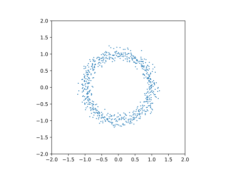

# 確率統計学
## 多次元の確率分布
#### 会津大学 コンピュータ理工学研究科 コンピュータ情報システム学専攻 髙橋輝
---

# 同時確率分布と周辺確率分布

---

## 同時確率分布
$n$ 個の確率変数 $X_1$, $X_2$, $\cdots$, $Xn$ の**同時確率分布**とは、確率変数の組 $(X_1, X_2, \cdots, X_n) \in R_n$に確率を対応させる関数のこと.

2次元の場合, 
$$
P(X = x, Y = y) = f(x, y)
$$
ただし, 
$$
f(x, y) \geq 0 かつ \displaystyle \sum_{x \in X} \sum_{y \in Y} f(x, y) = 1
$$

---

## 事象
一般に, 確率測度に対して可測である集合$A$を**事象**と呼ぶ.

……なんて？？？

(僕らが考える上では)そんな難しいことわかんないので、
(測度論の話は)省略

$$
\Pi_{i=1}^n X_i　の部分集合
$$

くらいのイメージでいいはず。

ちゃんと説明してほしい人がいたら、僕ができる範囲でする。

---

### 余談

ここら辺の確率変数の定義とかは、この本では(多分)意図的にぼかされて書いてある。
本来は、確率空間から可測空間への写像で定義されている。
前の章で扱った分布や、以下で扱う積分等も、本来は(確率空間と)可測写像の逆像によって定義されている。

---

## 事象の確率
(二次元の)事象$A$の確率は、同時確率分布$f$を用いて、以下のように定義される。
$$
P((x, y) = A) = \displaystyle \sum_{x \in A} f(x,y)
$$

---

## 同時確率密度関数
$X_i$が連続型の確率変数の時には, $f(x_i, \cdots, x_n)$を**同時確率密度関数**と呼ぶ.
$f(x_i, \cdots, x_n)$は,
$$
f(x_i, \cdots, x_n) \geq 0 かつ \displaystyle \int \cdots \int_{\mathbb{R}^n} f(x_1, \cdots, x_n) dx_1 \cdots dx_n = 1
$$
を満たす。
ここで, $\mathbb{R}^n$は$n$次元のユークリッド空間全体を指し、標本空間$\Omega$とも言われる。

この$f(x_i, \cdots, x_n)$によって, 事象$A$の確率は以下のように定義される。
$$
P((x_1, \cdots, x_n) = A) = \displaystyle \int \cdots \int_{A} f(x_1, \cdots, x_n) dx_1 \cdots dx_n
$$
一般に、$A$は領域(Region)となる。

---

## 周辺確率分布
同時確率分布から求められる, $X$, $Y$単独の確率分布のこと。
$$
g(x) = \displaystyle \sum_{y \in Y} f(x, y)
\hspace{10mm}
h(y) = \displaystyle \sum_{x \in X} f(x, y)
$$
それぞれ、$X$, $Y$の周辺確率分布と呼ぶ。
連続型の場合、周辺確率密度関数として、同時確率密度関数から以下のように定義される。
$$
g(x) = \displaystyle \int^{\infty}_{-\infty} f(x, y) dy
\hspace{10mm}
h(y) = \displaystyle \int^{\infty}_{-\infty} f(x, y) dx
$$
周辺確率分布(密度関数)から同時確率分布(密度関数)を求めることはできない。
(Exception. 変数が独立の場合)

---

## 共分散と相関係数

2変数$X$, $Y$の間に関連があれば、一方の変化は他方に及ぶと考えられるから、一般に分散の単純な加法は成り立たない。
$$
V(X + Y) \neq V(X) + V(Y)
$$

定義に基づいて計算すると, 
$$
V(X + Y) = V(X) + V(Y) + 2Cov(X, Y)
$$
となる。

---

### 実際の定義に基づいた共分散の計算

$$
V(X + Y) = \mathbb{E}[(X + Y - \mathbb{E}[X + Y]) ^ 2] \\
        = \mathbb{E}[(X^2 + Y^2 + 2XY) -2(X\mathbb{E}[X] + X\mathbb{E}[Y]+Y\mathbb{E}[X] + Y\mathbb{E}[Y])\\
         +(\mathbb{E}[Y]^2 + \mathbb{E}[X]^2 + 2\mathbb{E}[X]\mathbb{E}[Y]) ] \\
        = \mathbb{E}[(X^2 + Y^2 -2X\mathbb{E}[X] - 2Y\mathbb{E}[Y]+ \mathbb{E}[Y]^2 + \mathbb{E}[X]^2) \\
        - 2(XY - X\mathbb{E}[Y]-Y\mathbb{E}[X] + \mathbb{E}[X]\mathbb{E}[Y])  \\
        = \mathbb{E}[X^2] - \mathbb{E}[X]^2 + \mathbb{E}[Y^2]- \mathbb{E}[Y]^2 - 2\mathbb[(X- \mathbb{E}[X])(Y- \mathbb{E}[Y])] \\\
        = V(X) + V(Y) - 2\textrm{Cov}(X, Y)
$$

……つかれた。

---

## 共分散の意味

$$
Cov(X, Y) = \mathbb{E}[(X - \mathbb{E}[X])(Y - \mathbb{E}[Y])]
$$
式を見ればわかると思うが、共分散は$X$と$Y$の平均値からのばらつきが同じ方向にあるか、逆方向にあるかを示す指標として考えることができる。

---

## 相関係数
しかし、このままでは、異なる単位の変数の共分散を比較することができない。そこで、共分散を標準化したものが相関係数である。
確率変数$X$, $Y$の相関係数は以下のように定義される。
$$
\rho(X, Y)  = \rho_{XY}= \frac{Cov(X, Y)}{\sqrt{V(X)V(Y)}}
$$
$\rho(X, Y)$は必ず$-1 \leq \rho \leq 1$の範囲に収まる。(証明はP.138中段)

---

## 相関係数の意味
導出から明らかなように
$\rho > 0$ならば、$X$が大きくなると$Y$も大きくなり、
$\rho < 0$ならば、$X$が大きくなると$Y$は小さくなる傾向がある。

$\rho = \pm 1$ならば、$X$と$Y$は完全に線形に関連している。 (i.e. $X = aY + b$が成り立つ)

逆に、$\rho = 0$ならば、$X$と$Y$はどちらの関係を持つとも言えない。
（ただし、$X$と$Y$が独立であるとは限らない。）

---

## 無相関でも独立ではない例

---

## 共分散の簡単な計算方法
$$
\textrm{Cov}(X, Y) = \mathbb{E}[XY] - \mathbb{E}[X]\mathbb{E}[Y]
$$

導出は、
$$
\textrm{Cov}(X, Y) = \mathbb{E}[(X - \mathbb{E}[X])(Y - \mathbb{E}[Y])] \\
= \mathbb{E}[XY - X\mathbb{E}[Y] - Y\mathbb{E}[X] + \mathbb{E}[X]\mathbb{E}[Y]] \\
= \mathbb{E}[XY] - \mathbb{E}[X]\mathbb{E}[Y] - \mathbb{E}[X]\mathbb{E}[Y] + \mathbb{E}[X]\mathbb{E}[Y] \\
= \mathbb{E}[XY] - \mathbb{E}[X]\mathbb{E}[Y]
$$

---

## 離散型確率変数の共分散
$$
\textrm{Cov}(X, Y) = \sum_{x \in X} \sum_{y \in Y} (x - \mu_X) (y - \mu_Y) f(x, y)
$$
で求められるが、
$$
\mathbb{E}[XY] = \sum_{x \in X} \sum_{y \in Y} x y \cdot f(x, y)
$$
を用いて求めることが多い。

---

## 連続型確率変数の共分散
$$
\textrm{Cov}(X, Y) = \int_{-\infty}^{\infty} \int_{-\infty}^{\infty} (x - \mu_X) (y - \mu_Y) f(x, y) \mathrm{d}x \mathrm{d}y
$$
$$
\mathbb{E}[XY] = \int_{-\infty}^{\infty} \int_{-\infty}^{\infty} x y \cdot f(x, y) \mathrm{d}x \mathrm{d}y
$$

---

例はぶっ飛ばします！

よめばわかる。

---

# 条件付確率と独立な確率変数

---

## 条件付確率密度関数
条件付確率密度関数を以下のように定義する。
$$
g(x | y) = \frac{f(x, y)}{h(y)},
\hspace{1em}
h(y | x) = \frac{f(x, y)}{g(x)}
$$
(なお, $h(y)\neq 0, g(x) \neq 0$であることを仮定する。)

条件付確率密度関数も確率分布なので、モーメントを取ることができる。
そのままなので割愛。

---

## 独立な確率変数

同時確率分布において, あらゆる$x \in X, y \in Y$に対して、条件
$$
f(x, y) = g(x)h(y)
$$
が成り立つならば、$X, Y$は互いに独立であるという。

$$
f(x, y) = g(x)h(y)
であったので\\
g(x | y) = \frac{f(x, y)}{h(y)} = g(x) \\
h(y | x) = \frac{f(x, y)}{g(x)} = h(y)
$$
から、『独立』という表現を使う意味が分かる.

独立な確率変数と、独立な事象は(一応)別物であることに注意.

---

より一般に、$n$個の確率変数$X_1. X_2,\cdots, X_n$に対しても, その同時確率分布$f$が周辺確率分布$f_1, f_2, \cdots, f_n$の積に,
$$
f(x_1, x_2, \cdots, x_n) = f_1(x_1)f_2(x_2)\cdots f_n(x_n)
$$
のように分解されるならば、$X_1, X_2, \cdots, X_n$は互いに独立であるという.

Caution: これは、事象A, B, Cについて, $P(A \cap B \cap C) = P(A)P(B)P(C)$が成り立つことと同義ではないことに注意すること.

---

## 独立と無相関
P.13でも述べたように、一般に独立は無相関よりも強い仮定である。
なぜならば、無相関は平均的な性質である故、あるポイントとほかのポイントが打ち消しあって、結果的に無相関になることがあるからである。
一方、独立性は確率分布そのものに関する仮定である。

---

## 独立な確率変数の性質

### 積の期待値
$X, Y$が独立ならば
$$
\mathbb{E}[XY] = \mathbb{E}[X]\mathbb{E}[Y]
$$
### 無相関
独立ならば無相関となる。

---

## 独立な確率変数の性質

### 独立な確率変数の和とモーメント母関数
$X, Y$が独立ならば
$$
M_{X+Y}(t) = M_X(t)M_Y(t)
$$
なぜならば, 
$$
\mathbb{E}[e^{t(X+Y)}] = \mathbb{E}[e^{tX}e^{tY}] =\mathbb{E}[e^{tX}]\mathbb{E}[e^{tY}]
$$
だからである。

---

# 多次元正規分布

---

多数に関連しあう多数の確率変数を最初から仮定して用いられる確率分布が多(n)次元正規分布である。

任意の次元の正規分布も、標準正規分布$N(0, 1)$に従う乱数から生成できる。

ここでは, 2次元の正規分布を構成する。

---

## 2次元正規分布の構成
独立な$X_1, X_2 \sim N(0, 1)$があるとき, $a, b, c, d$を定数(ただし, $ad-bc \neq 0$)として, 確率変数の変換
$$
Y_1 = aX_1 + bX_2 ,
\hspace{1cm}
Y_2 = cX_1 + dX_2
$$

を行った時、期待値、分散、共分散、相関係数はどうなるか。
また、$Y_1, Y_2$の分布(同時確率密度関数)はどうなるか。

---

計算していくよ～～～～～！
$$
\mathbb{E}[Y_1] = a\mathbb{E}[X_1] + b\mathbb{E}[X_2] = 0 \\
\mathbb{E}[Y_2] = c\mathbb{E}[X_1] + d\mathbb{E}[X_2] = 0 
$$

$$
V(Y_1) = a^2V(X_1) + b^2V(X_2) = a^2 + b^2 \\
V(Y_2) = c^2V(X_1) + d^2V(X_2) = c^2 + d^2 \\
$$

$$
\textrm{Cov}(Y_1, Y_2) = \mathbb{E}[(Y_1 - E[Y_1])(Y_2 - E[Y_2])] \\
= \mathbb{E}[(aX_1+bX_2)(cX_1 + dX_2)]\\
= \mathbb{E}[acX_1^2 + adX_1X_2 + bcX_1X_2 + bdX_2^2]\\
= ac + bd
$$

---

同時確率密度関数を求める。
$$
X_1 \sim N(0, 1), X_2 \sim N(0, 1) より\\
f(x_1, x_2) = f(x_1)f(x_2) = \frac{1}{2\pi}\exp\left(-\frac{x_1^2 + x_2^2}{2}\right)である. 
$$
